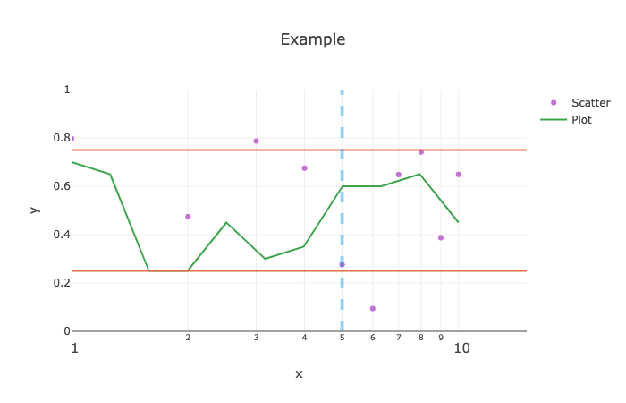

### SimplePlots.jl
##### Plots made Simple

---

+ To load use:

```julia
] add https://github.com/djsegal/SimplePlots.jl
using SimplePlots
```

+ A simple test case is:

```julia
scatter(
  rand(10), label="Scatter", color=4,
  xlabel="x", markersize=6
)

ylabel!("y")

cur_x = 10 .^ (0:0.1:1)
cur_y = rand(0.25:0.05:0.75, length(cur_x))

plot!(cur_x, cur_y, label="Plot", color=3, title="Example")

hline!([1,3] ./ 4, color=2)
vline!(5, linewidth=4, alpha=0.4, linestyle=:dash)

plot!(xlim=(1,15))

ylims!(0,1)
xscale!(:log10)
```


